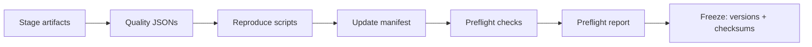

# Methods

## Factory Infrastructure (Days 1–14)

### Sandbox Execution (Day 1)

All circuit simulation and sampling runs inside a Docker container with strict resource isolation:

```
docker run --rm --network=none --read-only \
  --tmpfs /tmp:rw,noexec,nosuid,size=64m \
  --pids-limit 256 --cpus 2 --memory 4g \
  -v $REPO:/app:ro -v $OUT:/output:rw \
  $IMAGE python -m qec_noise_factory.jobs.mini_run_job ...
```

Key constraints:
- **`--network=none`**: No network access during simulation
- **`--read-only`**: Container filesystem is immutable
- **`--tmpfs /tmp`**: Writable scratch space, limited and non-executable
- **Resource caps**: CPU, memory, PID limits prevent runaway processes
- **Timeout**: Process killed if exceeding `timeout_s`

Two job types:
- **`run_mini_job_docker()`**: Fast mini-run (256–4096 shots) for sample generation
- **`run_qc_job_docker()`**: Heavy Sinter QC job for threshold estimation

### Deduplication + Sharding (Day 1.5)

**Sample key**: `SHA256(canonical_params + seed + code_version)` — deterministic, idempotent. If a key exists in the SQLite DB, the sample is skipped.

**Shard writer** (`factory/shard_writer.py`):
- Fixed-size records: `[det_bytes_per_shot][obs_bytes_per_shot]` per shot, interleaved
- Auto-rotation at `max_records_per_shard` (default 100K records)
- Per-block metadata as JSON lines in `.meta.jsonl`
- `close_and_hash()` → SHA256 integrity checksum

### Batch Orchestration (Day 2)

`orchestrator/run_pack.py` drives the factory pipeline:

1. **Load** pack definition from `pack_def.yaml`
2. **Propose** next configuration (uniform or ProposerV1)
3. **Execute** in sandbox → collect metrics + payload
4. **Gate** via quality gates → accept/reject/warn
5. **Store** in shard + insert metadata into SQLite
6. **Repeat** until all quotas filled
7. **Cleanup** intermediate files, git auto-commit

### Sinter QC Integration (Day 3)

Heavy QC path via `orchestrator/run_qc.py`:
- Runs standardized decoder evaluation (MWPM via PyMatching) inside Docker
- Produces `sinter_results.csv` with per-(distance, p, rounds) error rates
- Conclusiveness check: zero errors with few shots → `inconclusive`

### Pack Building + Noise Injection (Days 5–9)

**Circuit-level noise injection** (`factory/noise_models.py`):

Text-level pass over Stim circuit source, supporting `REPEAT` blocks and `TICK` boundaries:

| Gate type | Noise injected | Parameter |
|-----------|---------------|-----------|
| 1Q unitary (H, S, X, ...) | `DEPOLARIZE1(p1)` after gate | `p1` |
| 2Q gate (CX, CZ, ...) | `DEPOLARIZE2(p2)` after gate | `p2` |
| Measurement (M, MZ, MX) | Basis-appropriate error before | `p_meas` |
| Reset (R, RX, ...) | `X_ERROR(p_reset)` after reset | `p_reset` |
| TICK boundary | `DEPOLARIZE1(p_idle)` on idle qubits | `p_idle` |

Idle qubit tracking: qubits not touched between TICKs receive idle noise.

**Noise models** produce `CircuitLevelParams` from a base rate `p`:

| Model | p1 | p2 | p_meas | p_idle | p_reset |
|-------|-----|-----|--------|--------|---------|
| SD6-like | 0.1p | 1.0p | 1.0p | 0.1p | 0.1p |
| SI1000-like | 0.04p | 0.8p | 2.0p | 0.5p | 0.4p |
| Correlated | SD6-like + `CORRELATED_ERROR(corr_strength×p)` on 2Q pairs | | | | |

### Pack Catalog + Release Pipeline (Days 11–12)

**Catalog** (`factory/pack_index.py`):
- `PackIndexEntry`: sample counts, accepted/rejected/warned, quality distributions, QC status
- Built from SQLite DB + filesystem scan
- Output: `catalog.json` + `catalog.csv`

**Release pipeline** (`factory/release_pack.py`, 7 stages):



**Preflight** (`factory/preflight_release.py`): manifest validation, checksum verification, documentation completeness, quality threshold enforcement. Must pass in strict mode before release.

**Freeze output**:
- `versions.json`: code version, schema version, Stim version
- `checksums.sha256`: SHA256 of every artifact file
- `reproduce.ps1` / `reproduce.sh`: scripts to regenerate the pack

### Benchmark Harness (Day 14)

Proposal-level simulator (`factory/benchmark.py`) comparing Smart vs Random proposer efficiency without Docker:

- **Synthetic oracle**: `flip_rate(p) → bin → quota check` with log-normal jitter
- **3 modes**: baseline (random), smart_only (ProposerV1), full (ProposerV1 + adaptive QC)
- **Metrics**: acceptance rate, threshold density, conclusive rate, mean shots per accepted sample
- **Multi-seed**: `compare_runs()` runs all modes × N seeds, aggregates results
- **Output**: markdown comparison table + JSON + visualization (bin fill curves, acceptance rates)

---

## Noise Models

### PauliNoiseModel

All noise in this factory is based on the **Pauli channel model**, where each qubit gate can experience independent X, Y, or Z errors with specified probabilities. The model supports:

- **Symmetric depolarizing**: Equal X/Y/Z rates, `p_x = p_y = p_z = p/3`
- **Biased-Z**: Tunable Z-bias via `eta` parameter, `p_z = p * eta / (eta + 2)`
- **SI1000-like**: Superconducting-inspired noise with idle, measurement, and gate error channels scaled from a physical base rate
- **SD6-like**: Phenomenological model with detection and measurement noise scaled independently

Each model is defined by a `PauliChannel` (frozen, hashable tuple of X/Y/Z/I probabilities) and produces a `canonical_hash` for reproducibility tracking.

### Noise Compilation

The `NoiseCompiler` translates a `PauliNoiseModel` into Stim-compatible noise instructions:
- **Phenomenological mode**: Single `DEPOLARIZE1` on data qubits + `X_ERROR` on measurements
- **Circuit-level mode**: Per-gate `DEPOLARIZE1`/`DEPOLARIZE2` on each circuit layer

## Quality Control Pipeline

### Mini-Run Protocol

Each candidate sample undergoes a "mini-run" of `shots_initial` to `shots_max` shots (default 256–4096):
1. Generate Stim circuit with noise model at physical error rate `p`
2. Sample detection events and observables
3. Decode with PyMatching
4. Compute logical error rate (flip_rate = logical_flips / shots)

### Binning

Samples are classified by flip_rate thresholds:
| Bin | Condition | Interpretation |
|-----|-----------|----------------|
| Bin-A | flip_rate < p_easy | Very low noise regime |
| Bin-B | p_easy ≤ flip_rate < p_hard | Moderate noise (near threshold) |
| Bin-C | flip_rate ≥ p_hard | High noise regime |

### Quality Gates

The `quality_gate()` function checks shard-level health:
- **Reject**: all-zero shards, saturated rows, NaN/Inf metadata, extreme density
- **Warn**: label imbalance, missing provenance
- **QC conclusive check**: zero errors with few shots → `inconclusive`; zero errors with many shots → `pass` (upper bound established)

### Adaptive Shot Scheduler (Day 13)

The `ShotScheduler` dynamically adjusts shots within a mini-run:
- **Zero errors**: double shots (256 → 512 → ... → max) until upper bound established
- **High error rate (>30%)**: stop early, sufficient signal
- **Moderate errors**: use max shots for tight confidence intervals

## Smart Proposer (Day 13)

### Strategy Selection

`ProposerV1` uses a weighted random strategy selector:

| Strategy | Weight | Trigger |
|----------|--------|---------|
| `quota_fill` | 65% | Any bin below 50% of quota target |
| `threshold_refine` | 20% | Threshold bracket data available in DB |
| `explore` | 15%+ | Always (minimum exploration guarantee) |

### Anti-Overspecialization Guard

After 5 consecutive `quota_fill` failures on the same bin:
- `explore` weight increases from 20% → 50%
- `quota_fill` weight decreases from 65% → 30%
- Resets on first successful acceptance

### Proposal Tags

Each proposal records `{strategy, p_bucket, why}` in the DB (`proposal_tags_json` column) for post-hoc analysis and benchmarking.

---

## ML Data Pipeline (Day 15)

### Shard Format

Detection events and observable flips are stored as bitpacked `.bin` files with `.meta.jsonl` metadata:

| Field | Description |
|-------|-------------|
| `params_canonical` | JSON with circuit type, distance, rounds, basis, noise_model, p |
| `num_detectors` | Detector count (e.g., 120 for d=5) |
| `num_observables` | Observable count (typically 1 for memory experiments) |
| `physics_hash` | SHA-256 of the PauliNoiseModel for provenance |

### Data Splits (Day 15/19)

Three split policies for generalization testing:

| Split | Method | Purpose |
|-------|--------|---------|
| **WITHIN_MODEL** | Random block-level split | In-distribution baseline |
| **CROSS_MODEL** | Split by `physics_hash` | Cross-noise-model generalization |
| **OOD_P_RANGE** | Train on low-p, test on high-p | Out-of-distribution robustness |

All splits are **block-level** (entire shard blocks assigned to train/test) with disjointness assertion before every training run to prevent leakage.

### Surface Code Dataset (Day 20)

Generated via `scripts/generate_surface_shards.py`:
- **Grid**: 4 noise models × 3 distances × 2 bases × 5 p-values = 120 tasks
- **Samples**: 122,880 total
- **Distances**: d=3 (24 det), d=5 (120 det), d=7 (336 det)
- **Filter API**: `filter_dataset()` by min_detectors, circuit_families, distances, bases

---

## ML Training Pipeline (Day 16)

### Training Loop

`Trainer` class with:
- **Loss**: Binary cross-entropy with configurable `pos_weight` for class imbalance
- **Guards**: NaN detection, gradient clipping (max_norm=1.0), early stopping on loss plateau
- **Reproducibility**: `dataset_hash` (SHA-256 of training data), config_hash, seed control

### Models

| Model | Architecture | Parameters | Graph? |
|-------|-------------|------------|--------|
| Trivial | Always-zero | 0 | No |
| MLP | 2-hidden FC layers | ~15K | No |
| GNN v0 | 2 MP layers + mean pool + MLP head | ~20K | Yes |
| GNN v1 | 3 MP layers + mean_max pool + residual + LayerNorm + dropout | ~25K | Yes |

---

## Graph Representation (Day 17)

### Graph Construction

`GraphBuilder` creates deterministic graphs from circuit metadata:
- **Surface code**: Detector lattice from Stim circuit, edges from DEM error mechanisms
- **Demo repetition**: Linear chain (2 nodes, 1 edge)
- **Generic**: Fully-connected graph (fallback)

### Graph Hashing

`canonical_hash()`: JSON-serialize sorted edges + attributes → SHA-256. Edge-order invariant, used for provenance tracking in eval reports.

---

## GNN Architecture (Days 18/23)

### GNN v0 (Day 18)
- 2 GCN message-passing layers
- Mean readout (global average pool)
- 2-layer MLP classification head
- Input: `(B, N, 1)` — detector bit only

### GNN v1 (Day 23)
- 3 GCN message-passing layers with **residual connections**
- **LayerNorm** after each layer, **dropout(0.1)**
- 3 readout modes:
  - `mean`: global average pool
  - `mean_max`: concatenation of mean + max pool (captures hotspots)
  - `attn`: learned attention weights per node
- Input: `(B, N, F)` where F depends on featureset

### Feature Engineering (Day 23/24)

| Feature | F-dim | Description | Present in |
|---------|-------|-------------|------------|
| detector_bit | 1 | Raw detection event (0/1) | v1_full, v1_nop, v1_nop_nodist |
| deg_norm | 1 | Normalized node degree | v1_full, v1_nop, v1_nop_nodist |
| pos_idx_norm | 1 | Normalized positional index | v1_full, v1_nop, v1_nop_nodist |
| basis_01 | 1 | Measurement basis (X=0, Z=1) | v1_full, v1_nop, v1_nop_nodist |
| p_value | 1 | Physical error rate | v1_full only |
| distance_norm | 1 | Normalized code distance | v1_full, v1_nop only |

**Feature gating** (Day 24): `v1_nop` removes `p_value` to prevent shortcut learning in OOD scenarios.

---

## Calibration & Collapse Prevention (Days 21–25)

### Threshold Calibration (Day 21)

Grid search over thresholds [0.05, 0.95] to maximize a calibration metric on validation predictions:
1. Compute logits on validation set
2. Apply sigmoid → probabilities
3. Sweep 50 thresholds, pick best by chosen metric
4. Use calibrated threshold at test time

### Auto pos_weight (Day 21)

`auto_pos_weight()`: computes `count_neg / count_pos` from training labels. Addresses class imbalance (positive rate ~20% for d=5 surface codes).

### pos_weight Clamping (Day 22)

`pos_weight_max=8.0` prevents extreme weights (e.g., 12.04 in OOD split) from causing reverse collapse (TPR=100%, TNR→0%).

### Calibration Metrics

| Metric | Formula | Used For |
|--------|---------|----------|
| `bal_acc` | (TPR + TNR) / 2 | Default, balanced |
| `f1` | Harmonic mean of precision/recall | Best overall (Day 25 winner) |
| `bal_acc_minus_fpr` | bal_acc − λ·FPR | Explicit FPR penalty (Day 24) |

### Collapse Guard (Day 25)

Post-calibration check on `pred_positive_rate`:
- **Collapse**: PPR < 0.5% (all-negative) or PPR > 95% (all-positive)
- **Fallback cascade**: original metric → `f1` → `bal_acc`
- **Logged**: `fallback_applied`, `fallback_reason`, `fallback_metric_used`

---

## Calibration Sweep (Day 25)

### Grid

32 configurations: 2 featuresets × 2 readouts × 8 metric/lambda combos:
- Featuresets: `v1_full`, `v1_nop`
- Readouts: `mean_max`, `attn`
- Metrics: `bal_acc`, `f1`, `bal_acc_minus_fpr` (λ ∈ {0.05, 0.10, 0.15, 0.25})

### Pareto Selection

Three selection criteria:
1. **Best cross-model**: minimize FPR, tiebreak by precision then F1
2. **Best OOD**: non-collapse, maximize BalAcc, tiebreak by F1
3. **Best overall**: balanced score across both objectives

---

## MWPM Baseline (Day 26)

### Decoder Construction

1. **Rebuild circuit**: Extract (distance, rounds, p, basis, noise_model) from shard metadata
2. **Generate DEM**: `circuit.detector_error_model(decompose_errors=True)`
3. **Build matching**: `pymatching.Matching.from_detector_error_model(dem)`
4. **Cache**: One matching graph per unique (type, distance, rounds, basis, noise_model, p)

### Fairness Constraints

- Same dataset/splits as GNN experiments
- Same metric functions (`compute_metrics`)
- MWPM uses **no training labels** — only DEM knowledge
- GNN calibration uses validation set only (no test leakage)

### Latency Methodology

- **Warmup**: 200 samples (not timed)
- **Measurement**: per-batch timing with `time.perf_counter()`
- **Reported**: mean/median/p95 ms/sample, throughput (samples/s)
- **MWPM**: graph build time separated from decode time
- **GNN**: forward pass only (excludes dataloader overhead)
- **Device info**: CPU model, system, Python/PyTorch version logged

---

## DEM Graph Builder (Day 27)

### Shared Circuit Rebuild

`ml/stim/rebuild.py` — single source of truth for reconstructing Stim circuits from shard metadata. Used by both MWPM decoder (Day 26) and DEM graph builder.

### DEM Extraction Pipeline

1. **Rebuild circuit**: `rebuild_stim_circuit(distance, rounds, p, basis, noise_model)`
2. **Extract DEM**: `circuit.detector_error_model(decompose_errors=True)`
3. **Parse error terms** → classify by detector count:
   - **2 detectors**: standard edge (u, v)
   - **1 detector**: boundary edge to virtual node (detector → boundary_node)
   - **k>2 detectors**: clique expansion (all pairs), logged as `num_hyperedges_gt2`
   - **0 detectors**: observable-only term, skipped but counted
4. **Merge duplicate edges**: `p_total = 1 - Π(1 - p_i)` for same (u,v) from multiple DEM terms
5. **Compute weights**: `W = ln((1-p)/p)`, clamped to `[1e-12, 1-1e-12]`
6. **Canonical ordering**: edges stored as (min(u,v), max(u,v)), sorted lexicographically
7. **Deterministic hash**: SHA-256 of `canonical_json(build_key) + edge_index.tobytes() + edge_weight.tobytes()`

### DEM Build Key

Includes physics info for accurate provenance:
- `circuit_family`, `distance`, `rounds`, `basis`, `noise_model`, `p`
- `physics_hash` (from shard metadata)
- `schema_version` (for future compatibility)

### Storage Format

- `.npz`: `edge_index (2,E)`, `edge_weight (E,)`, `edge_prob (E,)`
- `.meta.json`: node_count, build_key, dem_info, hash, weight_formula

---

## GNN Decoder V2: Edge-Weighted Message Passing (Day 28)

### Edge Weight Transform

DEM matching weights `W = ln((1-p)/p)` are mapped to message scaling factors via `sigmoid(W)`:
- `p=0.01 → W≈4.6 → sigmoid≈0.99` (strong message — high confidence)
- `p=0.40 → W≈0.4 → sigmoid≈0.60` (moderate message)
- `p=0.50 → W=0.0 → sigmoid=0.50` (half message — no confidence)

### Weighted Message Passing

For each layer:
1. **Message**: `m_uv = sigmoid(W_uv) · W_msg(h_src)`
2. **Aggregate**: `h_agg[v] = Σ_u m_uv / Σ_u sigmoid(W_uv)` (weighted mean)
3. **Update**: `h' = LayerNorm(h + dropout(ReLU(W_self·h + h_agg + bias)))` (residual)

### Boundary Node Handling

DEM graphs have N+1 nodes (N detectors + 1 virtual boundary). Node features are padded:
- Detector nodes: original features + `is_boundary=0`
- Boundary node: all zeros + `is_boundary=1`

### Graceful Fallback

When `edge_weight=None`, V2 degenerates to V1-style unweighted mean aggregation. This allows the same model to run on both DEM and generic graphs.

### Backward Compatibility

V0/V1 models are unchanged. V2 is activated via `gnn_version="v2"` + `graph_mode="dem"` in `ExperimentConfig`. Trainer detects V2 via `model.uses_edge_weight` attribute.

## Unified Benchmark: Oracle vs Mismatch (Day 29)

### Fairness Problem

MWPM receives the exact Detector Error Model (DEM) from the circuit — this is **oracle** access to the physics. ML decoders learn from data and never see the DEM directly. A fair comparison must control for this information asymmetry.

### Mismatch Strategies

The benchmark tests MWPM under degraded physics knowledge:

| Strategy | What changes | Example |
|----------|-------------|---------|
| **Oracle** | Nothing — correct DEM used | MWPM built from true circuit params |
| **Model mismatch** | Wrong noise model for DEM | Data from `si1000_like`, MWPM uses `baseline_symmetric` |
| **P-scale mismatch** | Scaled error rate for DEM | True `p=0.01`, MWPM uses `p'=0.02` (scale=2.0) |

### Matching Weight Transform

MWPM matching weights are `W = ln((1-p)/p)`. Under p-scale mismatch:

```
p' = clamp(p × scale, ε, 1-ε)
W' = ln((1-p')/p')
```

Key property: the log-odds transform preserves relative ordering for moderate scales, so MWPM degrades gracefully. This explains why p_scale=2.0 only changes F1 by ~0.05%.

### Same-Split Guarantee

All decoders in a benchmark run use identical train/test splits. This is enforced by:
1. Computing `dataset_hash(meta, policy, seed)` per decoder
2. Asserting all hashes match within each policy group
3. Recording the split manifest in output artifacts

---

## Correlated Noise Model (Day 30)

### Correlated Crosstalk

The `correlated_crosstalk_like` model combines SD6-like independent noise with correlated two-qubit errors:

1. **Independent noise**: SD6-like, scaled by `(1 - corr_strength)`:
   - `p_1q = 0.1 × p_ind`, `p_2q = 1.0 × p_ind`, `p_meas = 1.0 × p_ind`
   - Where `p_ind = (1 - corr_strength) × p`

2. **Correlated noise**: `CORRELATED_ERROR(p_corr) X_q0 X_q1` after every DEPOLARIZE2 line:
   - `p_corr = corr_strength × p`
   - Produces XX errors on qubit pairs sharing a 2-qubit gate
   - Creates hyperedge (k>2) terms in the DEM

### Why This Matters

MWPM constructs a matching graph from the DEM. When the DEM has k>2 hyperedges, MWPM must approximate via **clique expansion** — replacing each k-body hyperedge with O(k²) pairwise edges. This approximation is inherently lossy: the original correlations cannot be exactly represented in a matching graph.

GNN decoders, by contrast, can learn arbitrary correlations from training data. The correlated noise benchmark tests whether this theoretical advantage translates to measurable performance gains.

### Benchmark v3 Suites

| Suite | Noise Data | Decoder Config | Purpose |
|-------|-----------|----------------|---------|
| A_ORACLE | Baseline | True DEM | Establish baseline F1 |
| B_P_SWEEP | Baseline | p_scale ∈ {0.1..500} | MWPM degradation curve |
| C_MODEL_MIS | Baseline | DEM from wrong model | Cross-model robustness |
| D_CORRELATED | Correlated | MWPM vs GNN | Correlated noise arena |

### Quality Gates

Hard FAIL conditions:
- NaN in any metric
- p_scale extremes don't degrade vs oracle (sanity check)
- Dataset hash inconsistency within suite (split contamination)
- No suite has any passing result
- All passing rows have `recall_tpr=0` (metric bug canary)
- No MWPM row has a `dem_graph_hash` (traceability check)

### Inference-Only Latency

Latency is measured separately from training via `latency_v2.measure_decoder_latency`:
- **Warmup**: first 256 samples discarded
- **Timing**: per-sample wall-clock time over remaining subsample (2048 samples)
- **Reported**: mean, median, P95, throughput (samples/s)
- **MWPM only** (GNN inference-only requires checkpoint loading, not yet automated)

### Suite D v2 — Per-p Evaluation (Day 31)

Suite D v2 replaces the single merged-dataset approach with per-p evaluation:

1. **p-Grid Selection**: The `select_p_grid_correlated()` function pre-scans candidate p values by:
   - Building the circuit at each candidate p
   - Sampling 512–1024 shots
   - Computing `detector_density` (fraction of fired detectors) and `y_rate` (observable flip rate)
   - Rejecting trivial (y_rate < 0.01) and saturated (density > 0.22) candidates
   - Selecting ≥5 informative p spanning low (y∈[0.05,0.08]), mid (y∈[0.08,0.22]), high (y∈[0.22,0.45]) bands

2. **Per-p Evaluation**: At each selected p, three decoders are evaluated independently on the filtered data subset:
   - **MWPM_ORACLE**: correct DEM (correlated_crosstalk_like)
   - **MWPM_MISMATCH**: wrong DEM (baseline_symmetric on correlated data) — tests model mismatch under correlations
   - **GNN_V2_DEM**: graph neural network trained per-p bucket

3. **Aggregate Summary**: Mean metrics across all p points per decoder.

| Suite | Noise Data | Decoder Config | Purpose |
|-------|-----------|----------------|---------|
| D_CORRELATED_V2 | Correlated (per p) | MWPM Oracle + MWPM Mismatch + GNN per p | Informative correlated arena |

### Informativeness Gates (Day 31)

Tri-state gates (PASS / WARN / FAIL) with stable reason codes:

| Gate | Condition | Status |
|------|-----------|--------|
| `trivial_regime` | > 60% of p points have y_rate < 0.01 | FAIL |
| `trivial_regime` | Some (< 60%) p points trivial | WARN |
| `saturated_regime` | Any p point has density > 0.22 | WARN |
| `suite_d_not_informative` | < 3 informative p points selected | FAIL |

On FAIL: `debug_informativeness.json` is written with per-p stats and violated thresholds.

### Day 31.5 Upgrades

#### Nearest-p Binning

The ±10% window from Day 31 is replaced by `assign_nearest_p()`:
- Each shard sample is assigned to the **closest** grid p value
- A `max_distance` parameter (default 0.5 = 50% relative distance) rejects outliers
- Result: `bin_counts.json` with exact per-bin sample counts

#### DEM Correlation-Mass Quantification

`dem_corr_stats()` computes per-p metrics from the Detector Error Model:
- **Total probability mass**: sum of all DEM term probabilities
- **k>2 probability mass**: sum of probabilities for terms with >2 detectors (true hyperedges)
- **k>2 mass ratio**: fraction of probability mass in correlated terms
- **Top-20 mass ratio**: concentration of probability in the 20 largest terms
- **Connected components**: structural complexity of the DEM graph

#### MWPM Triviality Probe

In long mode (`--long`), the p-grid selector runs a fast MWPM probe at each candidate p:
- Sample 256–1024 shots → decode with PyMatching → compute F1 score
- If `mwpm_probe_f1 > 0.995`, the p is too easy for MWPM and is rejected
- Prevents benchmarking in regimes where all decoders achieve trivial accuracy

#### Generate-on-Demand

When nearest-p binning yields zero samples for a grid point (missing shard data):
- In long mode: `generate_mini_dataset()` creates synthetic samples via Stim simulation
- In smoke mode: the p point is skipped with a log message

#### Seeds + Confidence Intervals

In long mode with `--seeds K`:
- The mismatch-vs-oracle comparison is repeated K times with different random seeds
- Per-seed mean delta_f1 (mismatch F1 − oracle F1) is computed
- 95% CI is calculated using normal approximation: `mean ± 1.96 * std / √K`
- Artifacts: `seed_results.json`, `ci_summary.json`

#### GNN Collapse Guard

Per-p GNN diagnostics record `pred_positive_rate` (fraction of positive predictions).
Collapse detection triggers when PPR < 0.5% (predicting all-negative) or PPR > 95% (predicting all-positive).

### Extended Informativeness Gates (Day 31.5)

| Gate | Condition | Status |
|------|-----------|--------|
| `corr_mass_too_low` | Min k>2 mass ratio < 0.02 | FAIL |
| `corr_mass_too_low` | Min k>2 mass ratio < 0.05 | WARN |
| `mwpm_trivial_regime` | Any selected p with MWPM probe F1 > 0.995 | FAIL |
| `candidate_rejection_rate_high` | > 60% candidates rejected | WARN |
| `p_bin_min_samples` | Min bin count < 512 | FAIL |
| `p_bin_min_samples` | Min bin count < 2048 | WARN |
| `gnn_collapse_guard` | PPR < 0.5% or > 95% | FAIL |
| `oracle_vs_mismatch_inconclusive` | 95% CI spans zero | WARN |

All reason codes are defined as stable constants in `reason_codes.py`.

### Empirical Validation (`--long --seeds 5`)

**p-Grid Selection**: The MWPM probe correctly rejected 5 trivial candidates (p ≤ 0.007, F1 > 99.5%) and 5 saturated candidates (p ≥ 0.07, density > 0.22). 5 informative p-values selected: 0.01, 0.015, 0.02, 0.03, 0.04.

**DEM Correlation-Mass**: Stable across all p-values at ~22% k>2 mass ratio (1257 hyperedges). This confirms that the correlated noise model consistently generates significant multi-detector error terms.

**Oracle vs Mismatch MWPM**: The performance gap widens monotonically with noise rate:
- At p = 0.01: virtually no gap (Δ = +0.02%)
- At p = 0.04: gap is 8.9% F1 (Oracle 83.08% vs Mismatch 74.18%)
- Aggregate: Oracle 92.95% vs Mismatch 89.66% (Δ = −3.29%)

**Seeds + CI**: 5 seeds, mean Δ F1 = −0.0035, 95% CI = [−0.0062, −0.0007]. CI does not span zero → mismatch degradation is statistically significant.

**Generated Data**: All p-values used on-demand generation (no shard matches), triggering `p_bin_min_samples` FAIL gate. GNN evaluation skipped for generated datasets (requires block metadata).

---

## Day 32 — Factor-Graph (Bipartite DEM) Decoder

### Motivation: Clique Expansion Loss

The GNN v2 (Day 28) uses **clique expansion** for k>2 DEM error mechanisms: a mechanism touching detectors {A, B, C} becomes edges (A,B), (A,C), (B,C). This discards the structural information that all three detectors share a single correlated error source.

The factor-graph decoder preserves this structure exactly via a **bipartite representation**:
- **Detector nodes** (V_D): one per syndrome detector + boundary
- **Error nodes** (V_E): one per merged error mechanism
- **Edges**: connect each error node to all detectors in its support set

### Merge Rule

DEM terms with identical support sets `(sorted_detectors, observable_mask)` are merged:

```
p_merge = 1 − Π(1 − p_i)
```

This maintains physical correctness: independent error sources contributing to the same syndrome pattern combine via independent-failure probability.

### Bipartite Message Passing

Each MP layer performs two aggregation steps:

1. **D→E**: `hE' = Norm(hE + dropout(ReLU(W_e·hE + W_d2e·AGG_d(hD) + b)))` — detector syndromes inform which errors are active
2. **E→D**: `hD' = Norm(hD + dropout(ReLU(W_d·hD + W_e2d·AGG_e(hE) + b)))` — error hypotheses refine detector embeddings

D→E messages are weighted by `sigmoid(error_matching_weight)`, matching the GNN v2 convention.

### Readout

Pool **only** error nodes where `observable_mask=True` (errors that flip a logical observable), then:

```
graph_emb = concat(mean(hE_obs), max(hE_obs))  → MLP → logit
```

### Anti-Leakage Design

- `observable_mask` is NEVER included in MP features — only used for readout selection
- Leakage tests: all-zero syndrome sanity, shuffled feature sensitivity
- Collapse guard: `pred_positive_rate` bounds (< 0.5% or > 95% → warning)

### Reason Codes (Day 32)

| Code | Condition | Level |
|------|-----------|-------|
| `ERR_PROVENANCE_MISMATCH` | DEM hash mismatch at load | FAIL |
| `FG_COLLAPSE_LOW` | Factor-graph PPR < 0.5% | FAIL |
| `FG_COLLAPSE_HIGH` | Factor-graph PPR > 95% | FAIL |
| `LEAKAGE_ZERO_SYNDROME` | Model confident on all-zero input | FAIL |
| `LEAKAGE_SHUFFLE_FAIL` | Performance unchanged after feature shuffle | FAIL |

---

## Day 33 — Factor-Graph v1: Precision/FPR Control

### Focal Loss

Replaces weighted BCE for v1. Reduces contribution of well-classified examples:

```
FL(p_t) = -α_t · (1 - p_t)^γ · log(p_t)
```

With γ=2.0, confident correct predictions contribute ~0 loss. This focuses gradient updates on hard negatives (false positives), directly targeting FPR reduction.

### F0.5 Calibration

V0 used balanced accuracy to select threshold. V1 uses F0.5 (β=0.5):

```
F_0.5 = (1.25 · P · R) / (0.25·P + R)
```

F0.5 weights precision 4× more than recall, selecting thresholds that reduce FPR at the cost of some recall. 37-point grid from 0.05 to 0.95.

### Collapse Guards (Day 33)

| Guard | Condition | Reason Code |
|-------|-----------|-------------|
| PPR low | pred_positive_rate < 0.5% | `FG_COLLAPSE_LOW` |
| PPR high | pred_positive_rate > 95% | `FG_COLLAPSE_HIGH` |
| TPR collapse | TPR < 5% and F1 > 0 | `FG_COLLAPSE_TPR` |
| Reverse collapse | FPR > 70% | `FG_REVERSE_COLLAPSE` |
| Metric integrity | TPR=0 but F1>0 | `METRIC_INTEGRITY_FAIL` |

### Reason Codes (Day 33)

| Code | Condition | Level |
|------|-----------|-------|
| `FG_COLLAPSE_TPR` | Factor-graph TPR < 5% | FAIL |
| `FG_REVERSE_COLLAPSE` | Factor-graph FPR > 70% | FAIL |
| `METRIC_INTEGRITY_FAIL` | TPR=0 but F1>0 (mapping bug) | FAIL |
| `HASH_MISSING` | Required hash field empty | FAIL |

---

## Day 34–37 — Density Residualization + Diagnostics

### Regime Lock (Day 34)

`RegimeLock` pins a single experimental configuration for controlled comparison:

| Parameter | Value | Purpose |
|-----------|-------|---------|
| distance | 5 | Surface code distance |
| target_p | 0.04 | Physical error rate |
| basis | X | Measurement basis |
| corr_strength | 0.5 | Correlated noise strength |
| n_samples | 2048 | Training samples per experiment |

Data is generated via `generate_locked_data(lock)` which calls Stim to produce samples at the exact locked regime.

### Density Residualization (Day 37)

The factor-graph decoder's output is decomposed into:

```
logit_final = logit_prior + alpha * z_norm
```

Where:
- `logit_prior`: K-bin density lookup (P(error | syndrome count K))
- `z_norm`: residual logit after KCS (the topology signal)
- `alpha`: learned interpolation weight, per K-bin or global

### K-Conditioned Standardization (KCS)

Normalizes residual logits within K-bins to remove density-dependent scale:

```
z_norm[i] = (z[i] - mu_K[bin(K[i])]) / max(sigma_K[bin(K[i])], sigma_floor)
```

Where `mu_K` and `sigma_K` are per-bin mean and standard deviation computed from the current batch. `sigma_floor=0.1` prevents division near zero.

### TopologyGain Metric (Day 36)

Measures whether the model learns structure beyond syndrome count:

```
TopologyGain = SliceC_clean − SliceC_scrambled
```

Where `SliceC` is the C-statistic (AUROC equivalent) of model predictions within K-slices. K-matched scrambling (shuffling detector bits while preserving K) destroys spatial structure but keeps density information.

### Density-Only Baseline (Day 36)

A non-parametric baseline that computes `P(error | K)` from training data. Used to quantify how much model performance is attributable to density lookup vs learned topology.

---

## Day 42–46 — K-Leakage Diagnosis + Mitigation

### G1 Probe (MLP variant, Day 42)

Original K-leakage measurement: train an MLP (2 layers, 64 hidden) to predict K from the model's internal representation `z`. The R² of this MLP measures how much K information leaks into the topology signal.

### Gradient Reversal Layer (GRL, Day 44)

Adversarial training to remove K information:

```
During forward: identity
During backward: gradient *= -lambda_grl
```

This encourages the encoder to produce representations from which K cannot be predicted. `lambda_grl` controls the strength of adversarial pressure.

### Leakage Penalty (Day 46)

Direct penalty on correlation between residual logit and K:

```
L_leak = lambda_leak * Corr(z_norm, K)²
```

Added to the main loss function to penalize representations that are linearly predictable from K.

### Iso-K Loss (Day 46)

Encourages the model to have similar prediction distributions within K-bins:

```
L_iso = lambda_iso * sum(var(z_norm[K==k]) for k in K_bins)
```

---

## Day 47–50 — Null-Space + Baseline Centering

### Null-Space Loss

Scrambled-detector null-space loss: the model should produce the same output on scrambled syndromes as on a null (zero-information) input:

```
z_scr = model(scramble(X))
L_null = lambda_null * ||z_scr - baseline||²
```

The baseline evolved across days:
- Day 47–48: Zero or prior-only
- Day 50: Per-step detached scrambled baseline (stop-gradient)

### Baseline-Centered Null-Space (Day 50)

```
z_centered = z_scr - sg(mean(z_scr_per_K_bin))
L_null = lambda_null * ||z_centered||²
```

Where `sg()` is stop-gradient. This centers the null-space target per K-bin, accounting for the fact that different K values naturally produce different scrambled outputs.

### Gate System (Days 42–50)

6 quality gates for model evaluation:

| Gate | Metric | Pass Condition |
|------|--------|----------------|
| G1 | R² (linear K→z probe) | R² ≤ 0.01 |
| G2 | AUROC on clean data | AUROC ≥ threshold |
| G3 | TopologyGain | TG > 0 |
| G4 | \|scr\| (scrambled residual norm) | \|scr\| ≤ 0.01 |
| G5 | A_ctrl (per-bin calibration) | ≥ 6/6 bins pass |
| G6 | Stability (across seeds) | All seeds pass |

---

## Day 51–54 — Sigma EMA + Controller

### Sigma EMA (Day 51)

Exponential moving average of per-bin standard deviation for KCS:

```
sigma_ema[k] = (1 - alpha_ema) * sigma_ema[k] + alpha_ema * sigma_batch[k]
sigma_used[k] = max(sigma_ema[k], sigma_floor)
```

Intended to provide stable normalization across batches. In practice, collapsed to `sigma_floor` after a few epochs.

### 3-Phase Controller (Day 54)

```
Phase 1 (warmup, epochs 1-3): lambda_leak=0, lambda_null=0 — let model learn base
Phase 2 (active, epochs 4-10): ramp up lambda_leak and lambda_null
Phase 3 (decay, epochs 11+): reduce penalty strength for stability
```

---

## Day 55 — G1 Probe Stabilization

### Linear Ridge CV Probe

Replaced MLP R² with Ridge regression (5-fold CV, N=4096 ProbeSet):

```python
probe_set = generate_probe_set(d, p, basis, N_probe, seed, corr_strength)
X_np = build_probe_features(model, ...)  # shape (N, 1) — logit_residual_norm
K_np = probe_set["K"]                     # shape (N,) — syndrome count

# Ridge regression: X = alpha * K + intercept
r2_score = cross_val_score(Ridge(alpha=best_alpha), X_np, K_np, cv=5, scoring='r2')
```

Key design decisions:
- **Ridge** (not OLS) for numerical stability
- **CV** (not train-only) to avoid overfitting on small features
- **N=4096** ProbeSet independent of training data
- **G1_thresh=0.01**: R² ≤ 0.01 required for pass

### Measurement Alignment

The G1 probe measures `logit_residual_norm` — the exact same tensor that K-orthogonalization modifies and that the model uses for final prediction. This ensures the probe and the intervention are aligned.

---

## Days 56–58 — K-Orthogonalization

### Core Idea

Remove linear K information from the residual logit via orthogonal projection:

```
z_ortho = z - w * beta * k0
```

Where:
- `z`: residual logit (shape `(B, D)`, currently D=1)
- `k0`: centered syndrome count `(K - mean(K)) / std(K)`
- `beta`: regression coefficient `Cov(z, k0) / Var(k0)` per channel
- `w`: ramp schedule weight (0 for warmup epochs, 1 for active epochs)

### Day 56 — Per-Batch OLS

```python
beta = Cov(z, k0) / Var(k0)  # OLS estimate, per batch
z_ortho = z - beta * k0
```

**Problem**: Beta unconstrained → explosion (β≈129).

### Day 57 — VectorKBetaWindow

Rolling window of batch statistics with safety features:

- `N_min=512`: No correction until enough samples accumulated
- `beta_hard_clamp=2.0`: Hard bound on |β|
- Magnitude cap: `|beta_cap| ≤ eta * sigma_z / sigma_k` (η=0.15)
- Correlation floor: `|corr| ≥ corr_min` (0.01) per channel
- Ramp schedule: `w = {ep1:0, ep2:0, ep3:0.25, ep4:0.5, ep5:0.75, ep6+:1.0}`
- Per-epoch window reset

**Problem**: Safeguards too conservative → β≈0, 27% NO_OP.

### Day 58 — EMAKOrtho (nn.Module)

Cross-epoch EMA β with global predictive gate:

```python
class EMAKOrtho(nn.Module):
    # register_buffer for: cov_zk_ema, var_k_ema, mu_z_ema, mu_k_ema, sigma_z_ema, n_seen
    
    def forward(z, K, epoch, training, frozen_beta=None):
        # 1. Update EMA statistics (training only, ema_alpha=0.05)
        # 2. First-batch exact initialization (no zero-bias)
        # 3. Compute beta = cov_zk_ema / max(var_k_ema, eps)
        # 4. Apply magnitude cap: |beta_cap| ≤ eta * sigma_z_ema / sqrt(var_k_ema)
        # 5. Global gate: R_global = |Corr(z·beta, k0)| — if < r_global_min, NO_OP
        # 6. Apply ramp schedule
        # 7. z_ortho = z - w * beta_cap * k0
```

Key changes from Day 57:
- **No per-epoch reset**: EMA accumulates cross-epoch
- **Global gate** replaces per-channel corr-floor
- **register_buffer**: proper state management (save/load, device transfer)
- **First-batch init**: EMA set to exact batch stats, not zero

**Problem**: R_global ≈ 0.02 (per-batch B=64 too noisy for weak signal) → gate never opens → 100% NO_OP.

### Ramp Schedule

All Day 57–58 variants use the same warmup ramp:

| Epoch | Weight | Status |
|-------|--------|--------|
| 1–2 | 0.0 | Warmup (schedule OFF) |
| 3 | 0.25 | Ramp |
| 4 | 0.50 | Ramp |
| 5 | 0.75 | Ramp |
| 6+ | 1.0 | Full active |

### Topology Evaluation

K-orthogonalization experiments measure topology impact via `exact_k_scrambler`:

```
mean_drop = SliceC(clean) - SliceC(scrambled)
```

Collapse detection: `ctrl_mean_drop - arm_mean_drop > 0.10` → topology collapse.

### Experiment Design

All Day 56–58 experiments use:
- 3 arms: Control (no ortho), Primary (active ortho), Fallback (frozen-epoch β)
- 3 seeds: 47000, 49000, 49200
- 12 epochs
- PASS criterion: active NO_OP ≤ 20%, median G1 reduction ≥ 30%, no topology collapse

---

## Day 59 — Frozen Beta (OrthoStatSet)

### OrthoStatSet

Pre-computed, frozen beta from an independent ProbeSet:

```python
class OrthoStatSet:
    beta: torch.Tensor       # shape (D,), frozen regression coefficient
    mu_z, sigma_z: Tensor    # z statistics from probe data
    mu_k, sigma_k: Tensor    # K statistics from probe data
    r_squared: float          # R² of linear K→z fit
```

Beta is computed once from a dedicated ProbeSet (seed+99991) and remains constant throughout training. This avoids the bootstrap problem (Days 56–58) where per-batch/EMA beta estimation was too noisy.

### Correction

```
k0 = (K - mu_k) / max(sigma_k, eps)
z_ortho = z - w * beta * k0
```

Where `w` follows the standard ramp schedule (0 → 0.25 → 0.5 → 0.75 → 1.0).

**Problem**: G1 went the wrong direction (−56%). Frozen beta from pre-training ProbeSet does not match the model's evolving representation — the beta/representation mismatch grows during training.

---

## Day 60 — Epoch-Rolling K-Ortho

### EpochRollingKOrtho

Recomputes beta per-epoch using a fresh ProbeSet forward pass:

```python
class EpochRollingKOrtho:
    def recompute(model, probe_set, epoch):
        z_probe = model.forward_probe(probe_set)  # fresh activations
        beta = Cov(z_probe, k0_probe) / Var(k0_probe)
        # Apply magnitude cap, correlation floor, ramp
```

This keeps beta aligned to the current representation. However, the recompute adds latency (one ProbeSet forward pass per epoch).

### Do-No-Harm Gate

```
if G1_pre > G1_post * (1 + harm_tolerance):
    revert beta to previous epoch
```

Prevents beta updates that increase leakage.

**Problem**: G1 increased by 40% (wrong direction). Even epoch-fresh beta combined with conservative gating failed — the correction direction was systematically wrong.

---

## Day 61 — ProbeSet-Synced K-Ortho + Gradient Shield

### ProbeSetSyncedKOrtho

Combines per-epoch beta recomputation with a gradient shield:

```python
class ProbeSetSyncedKOrtho:
    def sync_with_probeset(model, probe_set):
        z_probe = model.forward_probe(probe_set)
        beta = compute_probe_beta(z_probe, K_probe)
        # Simulated-post sanity check
        z_post = z_probe - beta * k0_probe
        G1_post = evaluate_g1(z_post, K_probe)
```

Key innovation: **simulated-post sanity check** — computes what G1 would be after correction and gates the update.

### OrthoGradientShield (autograd.Function)

Backward-only gradient modification — removes K-collinear component from gradients:

```python
class OrthoGradientShield(torch.autograd.Function):
    @staticmethod
    def forward(ctx, z_post, k_cent):
        ctx.save_for_backward(k_cent)
        return z_post  # identity in forward

    @staticmethod
    def backward(ctx, grad_output):
        k_cent = ctx.saved_tensors[0]
        proj = (grad_output * k_cent).mean() / ((k_cent**2).mean() + 1e-6)
        return grad_output - proj * k_cent, None
```

**Design**: Prevention (shielding the gradient from reintroducing K information) instead of correction (subtracting beta after the fact).

---

## Day 62 — Shield-Only vs Shield+Beta (Aligned Measurement)

### Mode Parameter

`ProbeSetSyncedKOrtho` gains a `mode` parameter:

| Mode | Beta applied? | Shield applied? |
|------|--------------|----------------|
| `SHIELD_AND_BETA` | Yes | Yes |
| `SHIELD_ONLY` | No | Yes |

### Measurement Alignment

Day 61's measurement alignment was verified via an `alignment_invariant_check`:

```python
def alignment_invariant_check(model, probe_set, k_ortho):
    z_probe = model.forward_probe(probe_set)  # same call path as training
    G1_at_forward = evaluate_g1(z_probe, K_probe)
    G1_at_eval = evaluate_g1_aligned(model, probe_set)
    assert abs(G1_at_forward - G1_at_eval) < 0.001
```

Ensures probe evaluations at training time match probe evaluations at analysis time.

### OOS A_ctrl

Out-of-sample topology validation using exact K-scrambling on the independent ProbeSet.

---

## Day 63 — E2E Validation (10 Seeds)

### Expanded Validation

Day 62's 3-seed ShieldOnly success expanded to 10 seeds:

| Seeds | 47000, 49000, 49200, 50000, 51000, 52000, 53000, 54000, 55000, 56000 |
|-------|------|

### Results

- **ShieldOnly wins 5/10 seeds, loses 5/10**
- Aggregate G1: 0.0301 vs Control 0.0195 (54.2% worse)
- Topology collapse on seed 53000
- Day 62's 3-seed success was a **selection artifact**

---

## Day 64 — Adaptive Soft Gradient Shielding (Mechanism-Family Closure)

### AdaptiveSoftGradientShield (autograd.Function)

Backward-only soft K-projection with partial removal:

```python
class AdaptiveSoftGradientShield(torch.autograd.Function):
    @staticmethod
    def backward(ctx, grad_output):
        k_cent, lam = ctx.saved_tensors[0], ctx.lam
        var_K = (k_cent**2).mean()
        if var_K / ctx.var_K_probe < 0.05:  # batch safety skip
            return grad_output, None
        proj = (grad_output * k_cent).mean() / (var_K + 1e-6)
        return grad_output - lam * proj * k_cent, None
```

Key changes from Day 62's `OrthoGradientShield`:
- **`lam` parameter**: Partial projection (λ < 1.0) — removes only λ fraction of K-collinear gradient
- **Batch variance safety skip**: If `var_K_batch / var_K_probe < 0.05`, skip projection (too noisy)

### AdaptiveSoftShieldController

Epoch-level hysteresis gate controlling shield activation:

```
if G1_raw_probe > threshold_on (0.020):  state = ON
elif G1_raw_probe < threshold_off (0.010): state = OFF
else: state = HOLD (keep previous state)
```

Warmup period (epochs 1–5): shield always OFF regardless of G1.

### Dose-Response Experiment

| Arm | λ | Gate | Batch Safety |
|-----|---|------|-------------|
| Control | — | — | — |
| AdaptiveSoftShield_50 | 0.50 | Hysteresis | var_K skip |
| AdaptiveSoftShield_25 | 0.25 | Hysteresis | var_K skip |

### Dose-Response Falsification

Reducing shield strength from 1.0 → 0.5 → 0.25 did NOT remove the topology-collapse failure mode (seed 53000), falsifying the "over-strength only" hypothesis.

### Mechanism-Family Closure

Because alignment, gating, and var(K) safety all passed while the same failure persisted, the failure is attributed to **mechanism incompatibility** (K-collinear gradient contains task-relevant topology signal in this scalar bottleneck), not instrumentation error.

### Pivot Rationale

Future work should avoid direct gradient-component amputation on Z_g1 and instead test representation-space factorization or auxiliary nuisance-routing architectures.

---

## Day 65 — Split Residual + Nuisance Siphon

### SplitResidualHead

After KCS, project the scalar residual into 2 dimensions:

```python
head = nn.Linear(1, 2, bias=True)  # z_raw → (z_topo, z_aux)
z_topo = head(z_raw)[:, 0]  # topology channel (used for prediction)
z_aux  = head(z_raw)[:, 1]  # nuisance channel (absorbs K)
```

### Nuisance Siphon Loss

Encourages `z_aux` to absorb K information, freeing `z_topo`:

```
L_siphon = λ_mse * MSE(z_aux, K_norm) + λ_decor * Corr(z_topo, K)²
```

**Finding**: Siphon did not siphon — both channels had near-zero K correlation. The +29.9% improvement came from the `Corr(z_topo, K)²` decorrelation regularizer, not architectural factorization.

---

## Day 66 — Decorrelation-Only Regularization

### Squared Pearson Decorrelation

Direct penalty on Z_g1–K correlation without architectural changes:

```
L_decor = λ * Corr(z_g1, K)²
```

### Hysteresis Gate

Adaptive engagement to prevent topology damage:

```
if G1_raw_probe > threshold_on (0.025):   state = ON
elif G1_raw_probe < threshold_off (0.015): state = OFF
else: state = HOLD
```

When OFF, `L_decor = 0` (no decorrelation applied). This protects clean seeds from harmful decorrelation.

**Finding**: Gate-protected decorrelation is safe but underpowered — global correlation cannot distinguish shortcut K-dependence from legitimate topology-linked covariance.

---

## Days 67–69 — Iso-K Local Ranking (ExactK)

### Core Mechanism

Instead of penalizing global Z-K correlation, rank Z_g1 values **within iso-K pairs** — samples with the same syndrome count K but different labels:

```python
def iso_k_hinge_loss(z_g1, K, Y, margin, delta_k=0):
    pairs = find_pairs(K, Y, delta_k)  # same-K, opposite-Y
    for (i_pos, i_neg) in pairs:
        loss += max(0, margin - (z_g1[i_pos] - z_g1[i_neg]))
    return loss / len(pairs)
```

### Pair Mining

For each batch, find pairs `(i, j)` where:
- `|K[i] - K[j]| <= delta_k` (K proximity)
- `Y[i] != Y[j]` (opposite labels)
- `Y[i] = 1` (positive sample) is the "should be ranked higher" sample

**ExactK** (`delta_k=0`): Only pairs with identical K. ~47 pairs/batch on average.
**NearK** (`delta_k=1`): Allows K±1 pairing. ~123 pairs/batch but reintroduces K-confounding.

### Key Finding (Day 67)

Exact K matching eliminates ALL K-confounding within pairs. NearK's ΔK=1 reintroduces the same confounding that global decorrelation suffers from. ExactK achieved +50.0% G1 reduction with zero topology collapses; NearK collapsed seed 53000.

### ExactK Tuned Config (Day 69 — Production)

| Parameter | Value | Rationale |
|-----------|-------|-----------|
| `delta_k` | 0 | Exact K matching only |
| `lambda_iso` | 0.10 | Iso-K loss weight |
| `margin` | 0.30 | Hinge target (reduced from 0.50 — make achievable) |
| `lambda_decay` | 0.85^(ep-8) for ep>8 | Gradual late-epoch reduction |
| `max_pairs` | 256 (d=5) / 512 (d=7) | Per-batch pair cap |
| `warmup_epochs` | 5 | No iso-K loss during warmup |

### Batch Standardization

Z_g1 is batch-standardized before pair ranking to prevent scale gaming:

```python
z_std = (z_g1 - z_g1.mean()) / max(z_g1.std(), eps)
```

This ensures the hinge margin operates on comparable scales across epochs and seeds.

---

## Day 70 — d=7 OOD Generalization + Late-Run Hardening

### Hardware Migration

d=7 required migrating from laptop to cloud GPU:

| | Development (Days 1–69) | Production (Day 70) |
|---|---|---|
| CPU | Intel Core i7-14700HX | Intel Xeon 6952P |
| RAM | 32 GB DDR5 | 188 GB |
| GPU | NVIDIA RTX 4060 (8 GB VRAM) | NVIDIA RTX PRO 6000 (96 GB VRAM) |
| Platform | Windows, local | RunPod, Linux Docker |

### d=7 Scaling Adaptations

| Parameter | d=5 (Day 69) | d=7 (Day 70) | Rationale |
|-----------|-------------|-------------|-----------|
| Detectors | 120 | 336 | 2.8× more syndrome bits |
| B (effective) | 128 | 256 | Larger batch for more iso-K pairs |
| micro_batch | 128 | 64 | Fit within GPU memory |
| grad_accum | 1 | 4 | Achieve B=256 via accumulation |
| max_pairs | 256 | 512 | More pairs needed at higher K variance |
| N_train | 4096 | 4096 | Unchanged |
| N_probe | 4096 | 4096 | Unchanged |

### Late-Run Hardening (5 measures)

Implemented after initial d=7 run hung at seed 10/10:

1. **Metric detach**: All metrics converted to Python `float()` / `.item()` immediately — prevents PyTorch compute graph retention in long-lived dictionaries.

2. **Incremental artifact saves**: Results JSON saved after each seed completion — crash-safe (loss of at most 1 seed's data).

3. **Memory telemetry**: CPU RSS (via `psutil`) and CUDA `memory_allocated` / `memory_reserved` logged at seed start/end.

4. **Cleanup boundaries**: `del model; gc.collect(); torch.cuda.empty_cache()` after each arm within each seed.

5. **Faulthandler**: `faulthandler.dump_traceback_later(600)` as 10-minute watchdog for hang detection.

### ProbeSet Evaluation Batching

Original: full ProbeSet (N=4096) forward pass in one call → CPU hang at d=7 (message passing on 336-node graph × 4096 samples).

Fix: mini-batch in chunks of 128:

```python
def build_probe_features(model, probe_set, device, eval_batch_size=128):
    all_logits = []
    for i in range(0, N, eval_batch_size):
        chunk = probe_set[i:i+eval_batch_size]
        logits = model(chunk.to(device))
        all_logits.append(logits.detach().cpu())
    return torch.cat(all_logits)
```

### Bipartite Graph Caching

The DEM bipartite graph (build_bipartite_graph) is deterministic for fixed (d, p, basis, noise_model). Cached globally and reused across all 10 seeds × 3 arms instead of rebuilding 30 times.

---

## Days 71–72 — Checkpoint Selection (Selector v1–v5)

### Problem

Epoch-median G1 measures treatment efficacy but deployment requires a **single epoch** checkpoint per seed. Naive min-G1 selection cherry-picks noise dips and is exploitable.

### Selector Evolution

| Version | Strategy | Result |
|---------|----------|--------|
| v1 | SliceClean > threshold + min G1 | 80% fallback at d=7 (SliceClean too noisy) |
| v2 | Catastrophic topo veto + min-G1 fallback | Arms converge (~0.002), no discrimination |
| v3 | Rolling-median G1 (window=3) + SliceClean ≥ 0.505 | 40% fallback, +2.5% Δ (too small) |
| v4 | Dual-cap (g1roll ≤ tau_clean AND g1_inst ≤ tau_clean_hi) | 0 violations but 60% TOPO_FAIL |
| v5 | argmax(TG) for CLEAN, argmin(g1roll) for LEAKY, empirical floor | +34.9% Δ, 5/10 CLEAN |

### Rolling Median G1 (v3+)

Instead of using single-epoch G1 (noisy), compute rolling median over a window of W=3 epochs:

```
g1roll[ep] = median(G1[ep-W+1 : ep+1])
```

This smooths epoch-to-epoch G1 jitter (which at d=7 is ~10× larger than d=5).

### Dual-Cap Qualification (v4+)

A seed is NOT eligible for CLEAN pool unless:
```
g1roll <= tau_clean (0.025)   AND
g1_inst <= tau_clean_hi (0.035)
```

This prevents selecting an epoch where rolling G1 is low but instantaneous G1 spikes above threshold.

### Spike Delta

```
spike_delta = g1_inst - g1roll
```

Measures how much instantaneous G1 deviates from the rolling median. Release criterion: max spike < 0.015.

---

## Day 73 — Selector v6 (Production Policy)

### drop_slice_floor Innovation

At d=7, the SliceClean metric (fraction of K-slices with AUROC ≥ 0.5) is noisy and blocks many valid epochs. v6 drops SliceClean from the survival filter entirely:

| Filter | v5 | v6 |
|--------|----|----|
| SliceClean ≥ floor | YES | **NO** (dropped) |
| tg_roll ≥ -0.015 | YES | YES |

This eliminates TOPO_FAIL: **0%** (vs 40% in v5).

### Pool Assignment

```
surviving = [ep for ep in epochs if ep >= active_epoch_min and tg_roll[ep] >= -0.015]

CLEAN = [ep for ep in surviving
         if g1roll[ep] <= tau_clean
         and g1_inst[ep] <= tau_clean_hi]

LEAKY = surviving - CLEAN
```

### Selection Within Pools

| Pool | Objective | Rationale |
|------|-----------|-----------|
| CLEAN | argmax(tg_roll) | Maximize topology quality once leakage is controlled |
| LEAKY | argmin(g1roll) | Minimize leakage when CLEAN criteria not met |
| TOPO_FAIL | argmin(g1roll) from all active epochs | Safety fallback |

### Production Results (retroactive on Day 70 data)

+60.0% Δ, 9/10 CLEAN, 0% TOPO_FAIL — best across all selector versions.

---

## Day 74 — v1.0 MLOps Hardening

### JSONL Write-Ahead Logging

```python
class EpochLogger:
    def log_epoch(self, record: dict):
        line = json.dumps(record, default=_convert) + "\n"
        self.fh.write(line)
        self.fh.flush()
        os.fsync(self.fh.fileno())
```

One JSON line per epoch with `os.fsync()`. Crash-safe — replay from JSONL to reconstruct full training history.

### Progressive Checkpointing

Best model checkpointed at epochs ≥ `active_epoch_min` (6). Receipt written per seed after selector runs on accumulated JSONL records.

### Backward Compatibility

Validated on d=5 (Day 69 data): 0% TOPO_FAIL, selector v6 produces identical results. Schema is d-invariant.

### Production Policy Summary

**"Train ExactK_Tuned_Prod (no DNH) + Selector v6 (drop_slice_floor, tg_roll floor)"**

| Component | What |
|-----------|------|
| Training | ExactK: ΔK=0, λ=0.10, margin=0.30, decay=0.85^(ep−8) |
| Selector | v6 + drop_slice_floor |
| Survival | tg_roll ≥ −0.015 only |
| CLEAN pool | dual-cap → argmax(tg_roll) |
| LEAKY pool | argmin(g1roll) |
| Logging | JSONL WAL with fsync per epoch |
| Checkpoints | Progressive, epochs ≥ 6 |

---

## Day 75 — V1.0 Holdout Validation + MLOps Hardening

### Holdout Design

Unseen seeds 60000–60009 at d=7, p=0.04, with frozen physics (ExactK: ΔK=0, λ=0.10, margin=0.30, decay=0.85^(ep−8)):

| Parameter | Value |
|-----------|-------|
| Seeds | 60000–60009 (holdout, never used in Days 1–70) |
| Distance | 7 |
| Arms | Control, ExactK_Tuned_Prod |
| B (effective) | 256 (micro=64, grad_accum=4) |
| Epochs | 12 |
| PROBE_BATCH_SIZE | 256 (mini-batched evaluation) |

### MLOps Hardening

1. **JSONL Write-Ahead Logging**: `EpochLogger` writes one JSON line per epoch with `os.fsync()`. Crash-safe — replay from JSONL to reconstruct state.
2. **Progressive Checkpointing**: Best model checkpointed at epochs ≥ 6 (active phase). Receipt written per seed.
3. **Post-Training Selection**: Selector v6 (`drop_slice_floor` variant) runs on JSONL epoch records after training, writes `selection_receipt_{seed}.json`.

### Selector v6 Logic

Two pools based on epoch-level metrics:

| Pool | Criterion | Objective |
|------|-----------|-----------|
| CLEAN | `g1roll ≤ tau_clean` AND `g1_inst ≤ tau_clean_hi` AND `tg_roll ≥ floor` | Maximize `tg_roll` (topology quality) |
| LEAKY | All surviving epochs not in CLEAN | Minimize `g1roll` (reduce leakage) |

Thresholds: `tau_clean=0.025`, `tau_clean_hi=0.035`, `tg_floor=-0.015`, `active_epoch_min=6`.

### V1.0 Closure KPIs (Day 75.2–75.3)

The initial deployment metric (Selected-G1 Δ%) was mathematically invalid due to the **Asymmetric Selection Paradox**: Control's LEAKY pool minimizes g1roll (near-zero), while Prod's CLEAN pool maximizes tg_roll. Ratios of near-zero values are meaningless.

Replaced with selector-consistent KPIs:

| KPI | Definition |
|-----|-----------|
| **Science Δ** | Epoch-median G1 (epochs ≥ 6), Prod vs Control |
| **Safe Yield** | % seeds selected into CLEAN pool |
| **KPI-A** | `median(tg_roll_selected)` Prod vs Control on CLEAN seeds (informational) |
| **KPI-B** | Epoch-median G1 improvement on leaky cohort seeds (Control ep-med ≥ 0.025) |
| **KPI-C** | Do-No-Harm: Prod selected G1 ≤ `tau_clean_hi` on clean Control seeds |

### Receipt Schema (Day 75.3)

Canonical receipt fields (all required, `extract_required_float` raises on None):

```
tg_roll_selected, g1roll_selected, g1_inst_selected, spike_delta,
selector_version, chosen_epoch, selector_pool, seed, arm
```

